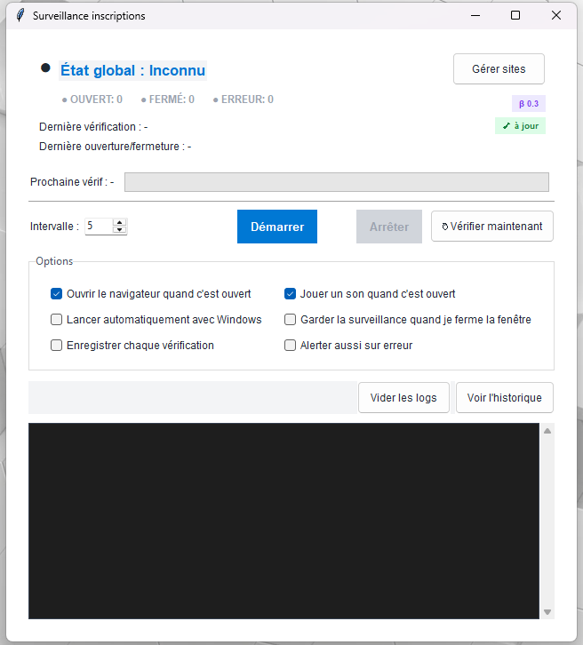

# CheckTracker

Application Windows de surveillance automatique des pages d’inscription de trackers.

Surveille par défaut : **la-cale.space**, **abn.lol**, **tctg.pm**, **hdf.world** + sites personnalisés.

## Fonctionnalités

- Vérification automatique à intervalle configurable (5–60 min)
- **↻ Vérifier maintenant** — vérification manuelle en un clic
- Détection basée sur **hash de contenu**
- Statuts : **CHANGÉ / INCHANGÉ / EN ATTENTE / ERREUR**
- Notifications Windows + son (optionnels)
- Démarrage en **zone de notification** quand lancé avec Windows
- Historique enrichi avec **hash précédent / nouveau**
- Activation/désactivation **par site** (cases à cocher)
- Réglages persistés entre sessions (intervalle, filtres, options)
- Détection automatique des mises à jour via GitHub Releases
- **.NET 8.0**

## Fonctionnement de la détection

CheckTracker charge la page d’inscription, nettoie le contenu (HTML, scripts, styles) puis calcule un **hash** :

- Hash différent → statut `CHANGÉ` → notification + log (si activés)
- Hash identique → statut `INCHANGÉ`
- Premier passage → statut `EN ATTENTE`

## Utilisation

Télécharge le dernier `.exe` depuis la page [Releases](../../releases) et lance-le.

Les données sont stockées dans :
`%AppData%\CheckTracker\`

- `sites.txt` — liste des sites et état (actif/inactif, timeout, hash)
- `logs.txt` — historique des vérifications

## Licence

Voir [LICENSE](LICENSE).

